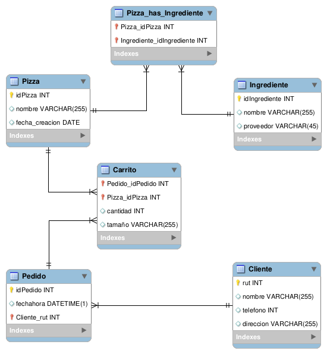
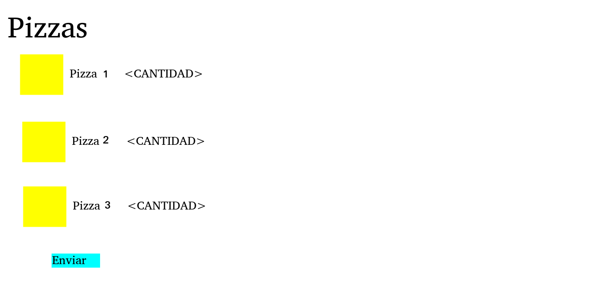
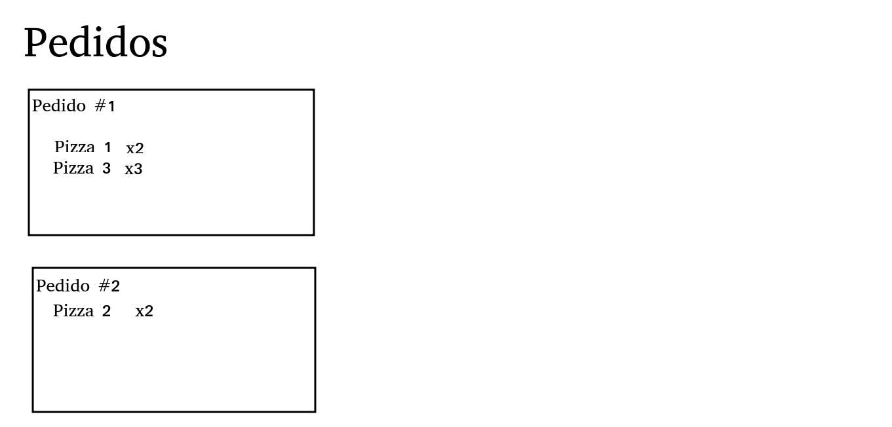

# Auxiliar 11

## Crear aplicaciones
Una vez clonado el repositorio base de la tarea 3, en este ejemplo se crean dos aplicaciones: `userApp` y `mainApp`. La aplicación de `userApp` servirá para manejar todo lo relacionado con la autenticación y sistema de usuarios del proyecto. En `mainApp` realizaremos todo lo relacionado con el proyecto en sí.

```python
python manage.py startApp mainApp
python manage.py startApp userApp
```
No olvidar agregar las aplicaciones al `INSTALLED_APPS` del `settings.py`.

Podemos aprovechar de integrar desde ya las rutas en el `tarea3/urls.py`:
```python
from django.contrib import admin
from django.urls import path, include

from django.conf.urls.static import static
from django.conf import settings

urlpatterns = [
    path('admin/', admin.site.urls),
    path('user/', include('userApp.urls')),
    path('', include('mainApp.urls')),
] + static(settings.MEDIA_URL, document_root=settings.MEDIA_ROOT)
```

NOTA IMPORTANTE 1: Al final del arreglo de `urlspatterns` hemos añadido ` + static(settings.MEDIA_URL, document_root=settings.MEDIA_ROOT)`. Esto permite que las imágenes que carguemos a los `models.ImageField` sean accesibles desde cualquier parte del proyecto.

NOTA IMPORTANTE 2: Si trabajaremos con `models.ImageFiled` tambien debemos instalar la libreria de `Pillow`:
```python
pip install Pillow
pip freeze > requirements.txt
```

## Crear los modelos
El primer paso siempre es el de crear los modelos correspondientes al Modelo Entidad Relación:


## Realizar mock-ups
Es importante, antes de lazarse a programar un proyecto, tener en cuenta las interacciones y cómo se deberían mostrar al usuario. Es por esto, que el paso siguiente es realizar bosquejos de mock-ups para la aplicación. Basta con un dibujo para entender qué es lo que debemos hacer.



### Crear campos personalizados para cada usuario
El modelo de `User` de django no trae algunos campos que podremos necesitar para un usuario. Es por esto que creamos un modelo llamado `Cliente` en `userApp/models.py` con los campos que necesitaremos:

```python
class Cliente(models.Model):
    user = models.OneToOneField(User, on_delete=models.CASCADE)
    telefono = models.IntegerField(null=True)
    direccion = models.CharField(max_length=255)
```

### Modelos para peddidos de pizza
En vista del MER, los modelos a construir son los siguientes:

```python
class Pizza(models.Model):
    nombre = models.CharField(max_length=255)
    descripcion = models.TextField(null=True)
    imagen = models.ImageField(upload_to="pizza-img/")

    def __str__(self):
        return self.nombre

class Pedido(models.Model):
    fechahora = models.DateTimeField(auto_now=True)
    cliente = models.ForeignKey(Cliente, on_delete=models.CASCADE)

class Ingrediente(models.Model):
    nombre = models.CharField(max_length=255)
    proveedor = models.CharField(max_length=255)


# Relaciones
class Carrito(models.Model):
    pedido = models.ForeignKey(Pedido, on_delete=models.CASCADE, related_name='carritos')
    pizza = models.ForeignKey(Pizza, on_delete=models.CASCADE)
    cantidad = models.IntegerField(default=1)
    tamano = models.CharField(max_length=15, choices=(("M", "Mediana"),
                                       ("L", "Familiar"),
                                       ("XL", "XL")))

class IngredientePizza(models.Model):
    pizza = models.ForeignKey(Pizza, on_delete=models.CASCADE)
    ingrediente = models.ForeignKey(Ingrediente, on_delete=models.CASCADE)
```

NOTA IMPORTANTE: Notar que el Modelo `Carrito` tiene el atributo `pedido` con un parámetro de `related_name`. Este parámetro sirve para obtener la inversa de la relación 1-N, es decir, obtener desde `Pedido` todos los `Carrito` con los que está relacionado.


### Migraciones
Luego, corremos las migraciones para aplicar estos modelos a la base de datos. Recordar cada vez que hacemos un cambio en los modelos, volver a correr las migraciones.
```sh
python manage.py makemigrations
python manage.py migrate
```
## Admin de django
Para tener un mejor manejo de los modelos y la base datos, podemos registrar los modelos en el `admin.py` de cada aplicación.
```python
admin.site.register(Cliente)
```
(userApp/admin.py)

```python
admin.site.register(Pizza)
admin.site.register(Pedido)
admin.site.register(Ingrediente)
admin.site.register(Carrito)
admin.site.register(IngredientePizza)
```
(mainApp/admin.py)


## Crear las views y templates
### Views, templates y urls relacionados con la autenticación
Partiremos desarrollando el sistema de autenticación de usuarios ya que es la parte más estándar y que probablemente sea casi igual en sus proyectos.

#### userApp/forms.py
Formularios para registrarse en el sistema y para logearse:

```python
class Registro(forms.Form):
    username = forms.CharField(label='Nombre de usuario')
    password = forms.CharField(label='Contraseña', max_length=32, widget=forms.PasswordInput)
    telefono = forms.IntegerField(label='Teléfono')
    direccion = forms.CharField(label='Dirección')

class IniciarSesion(forms.Form):
    username = forms.CharField(label='Nombre de usuario')
    password = forms.CharField(label='Contraseña', max_length=32, widget=forms.PasswordInput)
```

#### userApp/views.py
Definiremos vistas para acceder al formulario de registro (`registerView`), para crar un nuevo usuario (`newuser`), para acceder al formulario de login `loginView`, para autenticarse (`auth`) y otra para deslogearse (`logoutView`). Notar que solo las vistas `registerView` y `loginView` tienen asociado un template, que son los formularios respectivos; las otras vistas son llamadas desde acciones de los formularios.

```python
def registerView(request):
    form = Registro()
    return render(request, 'userApp/register.html', {'form': form})

def newuser(request):
    username = request.POST['username']
    password = request.POST['password']
    telefono = request.POST['telefono']
    direccion = request.POST['direccion']
    user = User.objects.create_user(username=username, password=password)

    cliente = Cliente(user=user, telefono=telefono, direccion=direccion)
    cliente.save()

    return render(request, 'mainApp/index.html')

def loginView(request):
    form = IniciarSesion()
    return render(request, 'userApp/login.html', {'form': form})

def auth(request):
    username = request.POST['username']
    password = request.POST['password']
    usuario = authenticate(username=username, password=password)
    login(request, usuario)
    return render(request, 'mainApp/index.html')

def logoutView(request):
    logout(request)
    return render(request, 'mainApp/index.html')
```

#### userApp/templates/userApp/*
Para esta aplicación crearemos dos templates, que corresponderán a los formularios de registro y login, que son casi iguales:
```html
<!DOCTYPE html>
<html lang="en">
<head>
    <meta charset="UTF-8">
    <title>Pizzas</title>
    
    
    
    
</head>
<body>
<nav class="navbar navbar-expand-lg navbar-light bg-light">
    <a class="navbar-brand" href="#">Logo</a>
    <button class="navbar-toggler" type="button" data-toggle="collapse" data-target="#navbarNavAltMarkup" aria-controls="navbarNavAltMarkup" aria-expanded="false" aria-label="Toggle navigation">
        <span class="navbar-toggler-icon"></span>
    </button>
    <div class="collapse navbar-collapse" id="navbarNavAltMarkup">
        <div class="navbar-nav">
            <a class="nav-item nav-link" href="">Bievenida <span class="sr-only">(current)</span></a>
            <a class="nav-item nav-link active" href="#">Registro</a>
        </div>
    </div>
</nav>

<h1>Registro</h1>

<div class="container">
    <form action="" method="POST">
        
        
        <input type="submit" value="Enviar">
    </form>
</div>

</body>
</html>
```
(register.html)

```html
<!DOCTYPE html>
<html lang="en">
<head>
    <meta charset="UTF-8">
    <title>Pizzas</title>
    
    
    
    
</head>
<body>
<nav class="navbar navbar-expand-lg navbar-light bg-light">
    <a class="navbar-brand" href="#">Logo</a>
    <button class="navbar-toggler" type="button" data-toggle="collapse" data-target="#navbarNavAltMarkup" aria-controls="navbarNavAltMarkup" aria-expanded="false" aria-label="Toggle navigation">
        <span class="navbar-toggler-icon"></span>
    </button>
    <div class="collapse navbar-collapse" id="navbarNavAltMarkup">
        <div class="navbar-nav">
            <a class="nav-item nav-link active" href="">Bievenida <span class="sr-only">(current)</span></a>
            <a class="nav-item nav-link" href="">Registro</a>
        </div>
    </div>
</nav>

<h1>Login</h1>
<div class="container">
    <form action="" method="POST">
        
        
        <input type="submit" value="Enviar">
    </form>
</div>

</body>
</html>
```
(login.html)

#### userApp/urls.py
Finalmente, para que todo funcione debemos añadir las rutas que hemos definido al `urls.py` de la aplicación para que todo funcione bien:

```python
from userApp.views import registerView, loginView, logoutView, auth, newuser

urlpatterns = [
    path('register/', registerView, name="register"),
    path('newuser/', newuser, name="newuser"),
    path('login/', loginView, name="login"),
    path('auth/', auth, name='auth'),
    path('logout/', logoutView, name='logout')
]
```

### Views, templates y urls relacionadas a la aplicación
#### mainApp/templates/mainApp/*
En base a los mock-ups, construimos los templates asociados a esta funcionalidad:

```html
<!DOCTYPE html>
<html lang="en">
<head>
    <meta charset="UTF-8">
    <title>Pizzas</title>
    
    
    
    
</head>
<body>
<nav class="navbar navbar-expand-lg navbar-light bg-light">
    <a class="navbar-brand" href="#">Logo</a>
    <button class="navbar-toggler" type="button" data-toggle="collapse" data-target="#navbarNavAltMarkup" aria-controls="navbarNavAltMarkup" aria-expanded="false" aria-label="Toggle navigation">
        <span class="navbar-toggler-icon"></span>
    </button>
    <div class="collapse navbar-collapse" id="navbarNavAltMarkup">
        <div class="navbar-nav">
            <a class="nav-item nav-link active" href="">Bievenida <span class="sr-only">(current)</span></a>
            <a class="nav-item nav-link" href="">Registro</a>
        </div>
    </div>
</nav>

<h1>Pide tu Pizza!!11</h1>



    <br><a href="">Cerrar sesión</a><br>

    <form method="POST" action="">
        
        <table class="table">
        
            <tr>
                <td></td>
                <td>{{ pizza.nombre }}</td>
                <td>{{ pizza.descripcion }}</td>
                <td><input type="number" name="pizza-{{ pizza.id }}" value=0></td>
                <td><select name="tamano-{{ pizza.id }}">
                    <option value="M">Mediana</option>
                    <option value="L">Familiar</option>
                    <option value="XL">XL</option>
                </select></td>
            </tr>
        
        </table>
        <input type="submit" value="Enviar">
    </form>


    <br> Debes <a href="">iniciar sesión</a> para pedir una pizza




</body>
</html>
```
(mainApp/index.html)

Aquí construimos un formulario "de forma manual" ya que no hay forma sencilla de construir un formulario ocupando los `Forms` de django. En esta vista, le estamos pasando a través del *contexto* un objeto llamado `pizzas`, el cual es un arreglo que contiene a todas las pizzas registradas en la base de datos. Es posible iterar sobre este arreglo usando la etiqueta `` teniendo así por cada pasada del *for* el objeto de una pizza.

Luego, para mostrar algún atributos del objeto de una pizza, lo podemos hacer mediante la etiqueta `{{ pizza.nombre }}`, donde este sería el caso en que quisieramos obtener el atributo `nombre` del objeto `Pizza`.

En este formulario, donde indicamos que ingresen la cantidad y el tamaño de las pizzas, creamos dos inputs: Uno del tipo `number` y otro un `select` con las distintas opciones de tamaños de pizzas. En este caso, como estamos iterando dentro de un for, se crearán dos imputs por cada pizza en el menú, teniendo cada input un `name` propio asociado a la pizza: Por ejemplo, la pizza con id 1, el formulario tendra el input de la cantidad con el parámetro `name=pizza-1` y el select asociado a su tamaño con el parámetro `name=tamano-1`.


```html
<!DOCTYPE html>
<html lang="en">
<head>
    <meta charset="UTF-8">
    <title>Pizzas</title>
    
    
    
    
</head>
<body>
<nav class="navbar navbar-expand-lg navbar-light bg-light">
    <a class="navbar-brand" href="#">Logo</a>
    <button class="navbar-toggler" type="button" data-toggle="collapse" data-target="#navbarNavAltMarkup" aria-controls="navbarNavAltMarkup" aria-expanded="false" aria-label="Toggle navigation">
        <span class="navbar-toggler-icon"></span>
    </button>
    <div class="collapse navbar-collapse" id="navbarNavAltMarkup">
        <div class="navbar-nav">
            <a class="nav-item nav-link active" href="">Bievenida <span class="sr-only">(current)</span></a>
            <a class="nav-item nav-link" href="">Registro</a>
        </div>
    </div>
</nav>

<h1>Pedidos</h1>



    <br><a href="">Cerrar sesión</a><br>

    
        <div class="card" style="width: 18rem;">
            <div class="card-body">
                <h5 class="card-title">Pedido #{{ pedido.id }}</h5>
                
                    <p class="card-text">{{ carrito.pizza }}<br>
                    {{ carrito.tamano }}<br>
                    x{{ carrito.cantidad }}</p>
                
            </div>
        </div>
    


    <br> Debes <a href="">iniciar sesión</a> para ver los pedidos.




</body>
</html>
```
(mainApp/pedidos.html)

#### views.py
```python
from django.shortcuts import render
from mainApp.models import Pizza, Pedido, Carrito

def index(request):
    context = {"pizzas": Pizza.objects.all()}
    return render(request, 'mainApp/index.html', context)

def pedir(request):
    pedido = Pedido(cliente=request.user.cliente)
    pedido.save()

    for k in request.POST:
        if k.startswith('pizza-'):
            pizza_id = int(k[6:]) # Extraemos solo el número de pizza-n y lo convertimos a entero. Ej: "pizza-4" -> 4
            cantidad = int(request.POST[k]) # Convertimos a entero esta cantidad
            tamano = request.POST["tamano-"+str(pizza_id)] # Extraemos el tamaño de la pizza por su ID.

            carrito = Carrito(pedido=pedido,
                              pizza=Pizza.objects.get(id=pizza_id),
                              cantidad=cantidad,
                              tamano=tamano)
            carrito.save()

    #context = {"pizzas": Pizza.objects.all()}
    #return render(request, 'mainApp/index.html', context)
    return index(request)

def pedidos(request):
    listapedidos = Pedido.objects.filter(cliente=request.user.cliente)

    context = {"pedidos": listapedidos}
    return render(request, 'mainApp/pedidos.html', context)

```
En la vista `pedir` estamos procesando los datos capturados por el formulario de pizzas. En palabras sencillas, lo que estamos haciendo acá es crear un nuevo `Pedido` al cual le vamos a asociar un `Carrito` por cada cantidad y tamaño de pizza ingresado en el formulario. Para crear un `Carrito` por cada pizza, iteramos todos los parámetros entregados en la `request` por POST y buscamos aquellos que en el nombre empiecen con `pizza-` para así poder extraer la id de la pizza asociada a este input del formulario. Extraemos también su tamaño para finalmente poder crear un `Carrito` asociado al `Pedido` recien creado.

#### urls.py
```python
from mainApp.views import index, pedir, pedidos

urlpatterns = [
    path('', index, name="index"),
    path('pedir/', pedir, name="pedir"),
    path('pedidos/', pedidos, name="pedidos"),
]
```
